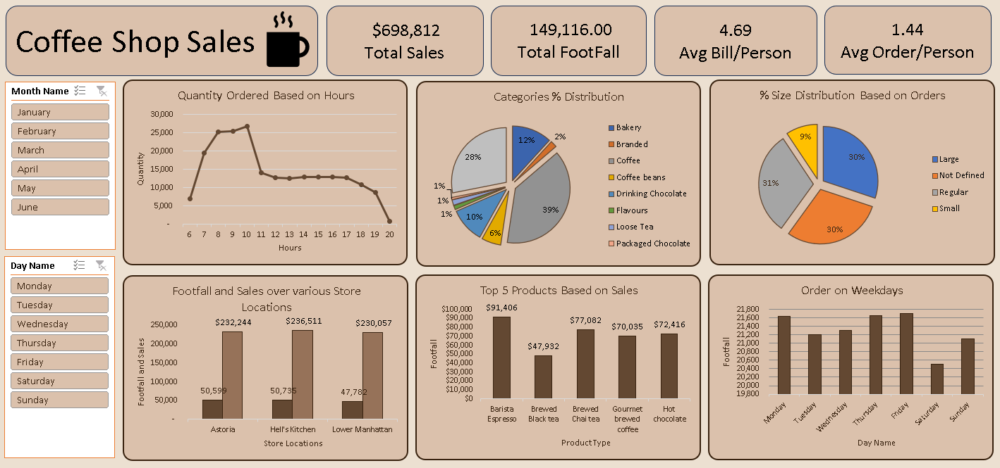

# Coffee Shop Sales Analysis

## Project Overview
Interactive Excel dashboard analyzing coffee shop sales,
footfall, orders, products, categories, store locations,
days, and hours.

## Tools & Techniques
- Microsoft Excel
- Pivot Tables
- Slicers
- Charts
- KPI Analysis
- Data Visualization

## Key Analysis
- Sales and footfall trends
- Peak sales hours
- Monthly and weekday analysis
- Top-performing products
- Category-wise analysis
- Store performance
- Average Bill/Person
- Average Order/Person

## Dashboard Preview

