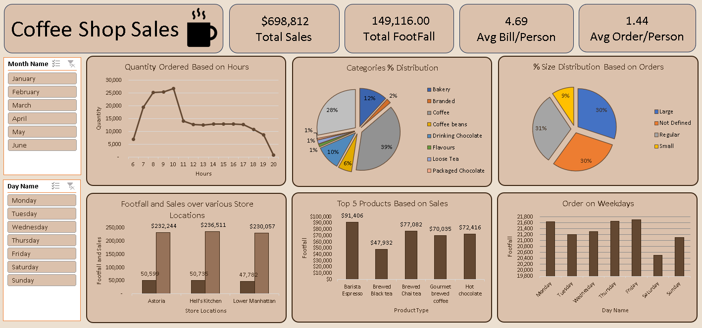

# Coffee Shop Sales Analysis

An interactive **Microsoft Excel dashboard** for analyzing coffee shop sales, footfall, orders, products, categories, store locations, weekdays, and hourly sales patterns.

## Project Overview

This project analyzes coffee shop transaction data from **January to June 2023** and transforms the raw transaction-level data into an interactive Excel dashboard.

The dataset contains **149,116 transaction records across 18 columns**, covering transaction details, store locations, products, categories, transaction quantities, prices, sales amounts, dates, days, and hours.

The dashboard provides a consolidated view of key business metrics and allows users to explore sales performance through interactive slicers, Pivot Tables, charts, and KPI calculations.

---

## Dataset

The dataset contains **149,116 transaction records** covering the period from **January 1, 2023 to June 30, 2023**.

### Dataset Columns

| Column | Description |
|---|---|
| `transaction_id` | Unique identifier for each transaction |
| `transaction_date` | Date of the transaction |
| `transaction_time` | Time of the transaction |
| `store_id` | Unique identifier for the store |
| `store_location` | Location of the coffee shop |
| `product_id` | Unique identifier for the product |
| `transaction_qty` | Quantity of products ordered |
| `unit_price` | Price per product unit |
| `total_bill` | Total transaction amount |
| `product_category` | Product category |
| `product_type` | Type of product |
| `product_detail` | Detailed product description |
| `Size` | Product size |
| `Month Name` | Month of the transaction |
| `Day Name` | Day of the week |
| `Hour` | Hour of the transaction |
| `Day of Week` | Numeric representation of the weekday |
| `Month` | Numeric representation of the month |

---

## Key Metrics

The dashboard provides the following primary KPIs:

| KPI | Value |
|---|---:|
| Total Sales | $698,812 |
| Total Footfall | 149,116 |
| Average Bill / Person | $4.69 |
| Average Order / Person | 1.44 |
| Total Transaction Quantity | 214,470 |

---

## Tools & Techniques

- **Microsoft Excel**
- **Pivot Tables**
- **Slicers**
- **Charts**
- **KPI Analysis**
- **Data Visualization**
- **Data Aggregation**
- **Interactive Dashboard Development**

---

## Dashboard Features

### 1. KPI Summary

The dashboard provides a high-level summary of coffee shop performance through four key metrics:

- Total Sales
- Total Footfall
- Average Bill per Person
- Average Order per Person

These KPIs provide a quick overview of overall business performance.

---

### 2. Monthly Filtering

A **Month Name slicer** allows users to filter the dashboard by individual months.

Available months:

- January
- February
- March
- April
- May
- June

This enables users to analyze how sales and customer activity change over time.

---

### 3. Weekday Filtering

A **Day Name slicer** allows users to analyze performance for individual days of the week:

- Monday
- Tuesday
- Wednesday
- Thursday
- Friday
- Saturday
- Sunday

This helps identify differences in customer activity throughout the week.

---

### 4. Hourly Order Analysis

The dashboard analyzes order quantity by hour.

The hourly analysis helps identify:

- Peak ordering periods
- Lower-traffic periods
- Changes in order volume throughout the day

This can help understand when customer demand is highest and how order activity changes across operating hours.

---

### 5. Product Category Analysis

The dashboard includes a category-level distribution of orders.

Categories analyzed include:

- Bakery
- Branded
- Coffee
- Coffee Beans
- Drinking Chocolate
- Flavours
- Loose Tea
- Packaged Chocolate
- Tea

This provides visibility into the contribution of different product categories to overall sales activity.

---

### 6. Product Size Analysis

Orders are analyzed by product size:

- Large
- Regular
- Small
- Not Defined

The size distribution visualization shows how orders are distributed across different product sizes.

---

### 7. Store Location Analysis

The dashboard compares sales and footfall across the three store locations:

- Astoria
- Hell's Kitchen
- Lower Manhattan

This allows users to compare store-level performance and identify differences in customer activity and sales.

---

### 8. Top Product Analysis

The dashboard identifies the **top-performing products based on sales**.

The visualization highlights products such as:

- Barista Espresso
- Brewed Chai Tea
- Hot Chocolate
- Gourmet Brewed Coffee
- Brewed Black Tea

This helps identify products contributing significantly to overall sales.

---

### 9. Weekday Order Analysis

Orders are compared across all seven days of the week.

This visualization helps identify:

- Higher-order weekdays
- Lower-order weekdays
- Differences in customer activity throughout the week

---

## Dashboard Preview



The dashboard combines KPI cards, slicers, line charts, bar charts, and distribution charts into a single interactive reporting interface.

---

## Key Analysis Areas

The dashboard enables analysis of:

- Sales performance
- Customer footfall
- Order quantity
- Average bill per person
- Average order per person
- Monthly sales trends
- Hourly order trends
- Weekday order patterns
- Store-level performance
- Product category distribution
- Product size distribution
- Top-performing products

---

## Excel Techniques Used

### Pivot Tables

Pivot Tables are used to aggregate transaction-level data and generate summaries for:

- Monthly sales
- Hourly order quantities
- Weekday orders
- Product categories
- Product types
- Store locations

### Slicers

Slicers provide interactive filtering for:

- Month
- Day of Week

This allows users to dynamically change the dashboard view.

### Charts

Multiple chart types are used to communicate different aspects of the data, including:

- Line charts
- Column charts
- Bar charts
- Pie charts

### KPI Calculations

The dashboard summarizes key business metrics including:

- Total Sales
- Total Footfall
- Average Bill / Person
- Average Order / Person

---

## Business Questions Addressed

The dashboard can be used to answer questions such as:

- What is the total sales generated by the coffee shop?
- How many transactions/orders were recorded?
- What is the average bill per person?
- What is the average number of orders per person?
- Which months have higher transaction activity?
- What are the peak ordering hours?
- Which store location generates the most sales?
- Which store has higher footfall?
- Which product categories contribute most to sales?
- Which products are the top performers?
- How are orders distributed across product sizes?
- Which weekdays have higher order activity?
- How does sales performance change across different months?

---

## Project Structure

```text
Coffee-Shop-Sales-Analysis/
│
├── Coffee_Shop_Sales_Dashboard.xlsx
├── Coffee Shop Sales Analysis.pdf
├── README.md
│
└── screenshots/
    └── dashboard.png
